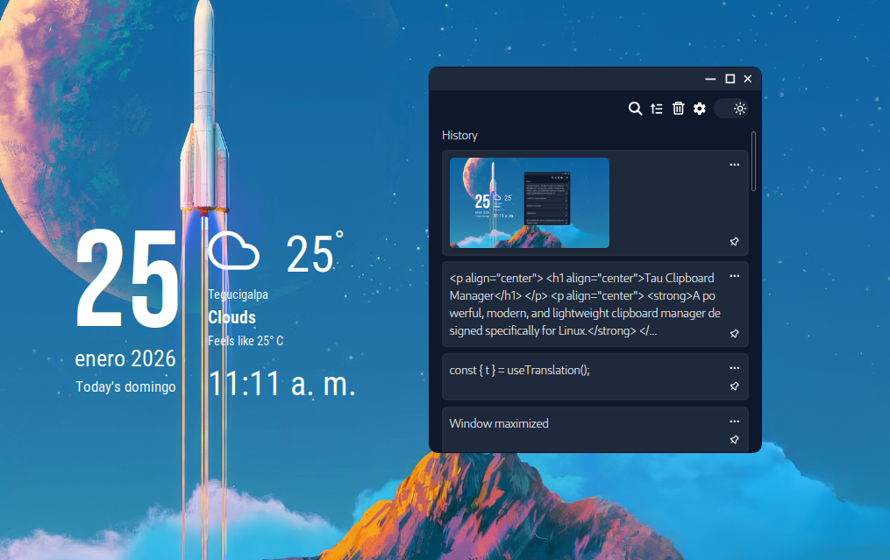
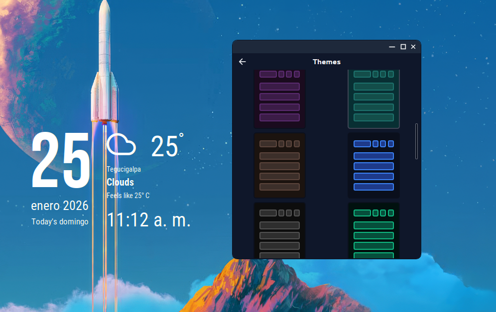
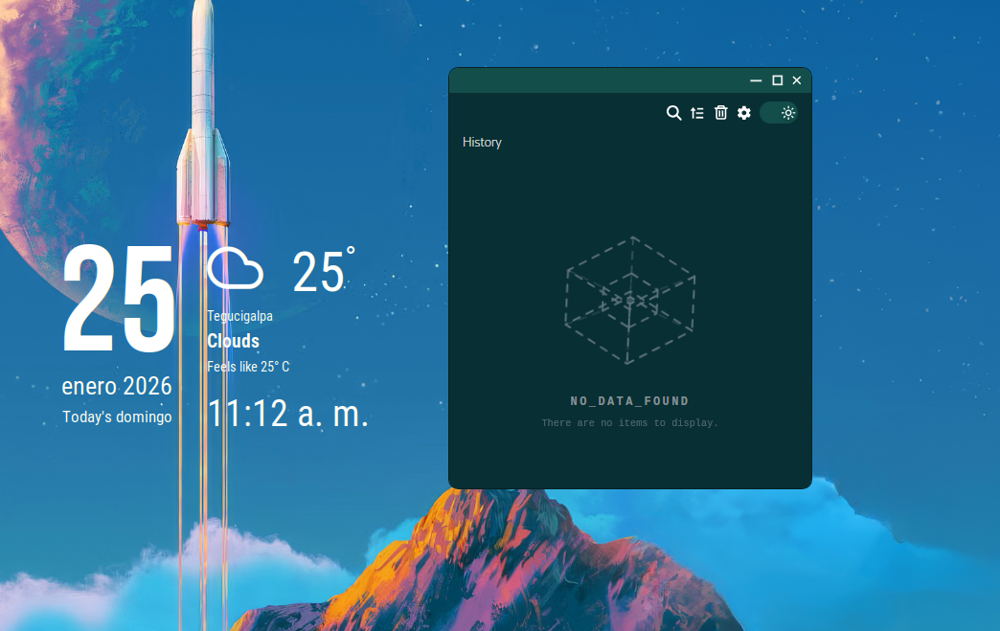

<p align="center">
  <h1 align="center">Tau Clipboard Manager</h1>
</p>

<p align="center">
  <strong>A powerful, modern, and lightweight clipboard manager designed specifically for Linux.</strong>
</p>

<p align="center">
  Built with <b>Tauri</b>, <b>React</b>, and <b>TypeScript</b>.
</p>

<p align="center">
  <a href="./LICENSE"></a>
  
  
</p>

---

---

## 📸 Demo & Screenshots

| 📋 Clipboard History |
| :---: |
|  |
| *Clean history view with thumbnails* |

<br>

| 🎨 Settings & Themes |
| :---: |
|  |
| *Fully customizable theming engine* |

<br>

| ✨ Minimal Interface |
| :---: |
|  |
| *Modern and unobtrusive design* |

---

<br>

## 🚀 Features

### 📋 Clipboard History
- **Text Support**: Automatically captures plain text. Includes a built-in editor to modify content before pasting.
- **Image Support**: Captures copied images, displays thumbnails in the history, and allows copying them back to the clipboard.
- **Smart Search**: Instantly find items in your history with a real-time search bar.
- **Pinning**: Pin important snippets to prevent them from being auto-deleted.
- **Sorting**: Order items by date (ascending or descending).

### 🎨 Customization & Themes
- **Theming Engine**: Choose from pre-installed themes or **create your own**.
  - Customize primary, secondary, and tertiary colors.
  - Adjust border widths, colors, and font sizes.
- **UI Tweaks**: Toggle rounded window corners for a distinct look.
- **Dark/Light Mode**: Fully supports system preferences or manual toggling.

### ⚙️ Advanced Settings
- **History Limits**: Set a maximum number of items to keep (e.g., 50, 100, or unlimited).
- **Auto-Cleanup**: Configure auto-deletion of items after a specific time (e.g., 24 hours).
- **Global Shortcuts**: Customizable keyboard shortcut (default `Ctrl+H`) to toggle the window visibility instantly.
- **Localization**: Available in **English** and **Spanish**.

### 🐧 Linux Optimized
- **Tray Icon**: Runs quietly in the background for quick access.
- **Performance**: Built with **Rust (Tauri)**, ensuring minimal resource usage (RAM/CPU) compared to traditional Electron apps.

## 🗺️ Roadmap

We are constantly working to improve Tau. Here are features planned for future updates:
- [ ] Support for Audio & Video files preview.
- [ ] Support for Document/File paths.
- [ ] Cloud sync between devices.
- [ ] Plugin system.

## 🛠️ Technologies Used

- **Core**: Tauri (Rust)
- **Frontend**: React + TypeScript
- **Build Tool**: Vite
- **Styling**: TailwindCSS
- **Icons**: React Icons

## 📦 Installation

### Prerequisites

Ensure you have the following dependencies installed on your Linux system.

**Ubuntu / Debian:**
```bash
sudo apt-get update
sudo apt-get install -y libgtk-3-dev libwebkit2gtk-4.1-dev libappindicator3-dev librsvg2-dev patchelf libsoup-3.0-dev javascriptcoregtk-4.1-dev